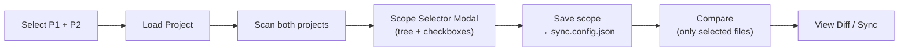
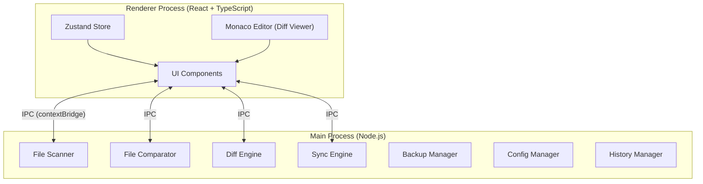

# Phase 1 (MVP) — Implementation Plan

## Goal

Build a functional Electron desktop app that can **compare** and **sync** files between two projects (P1 ↔ P2), with the dark-theme UI validated in the prototype, including Tree View, keyboard shortcuts, config editor, sync history, file preview, and **scope selection**.

---

## User Flow



> [!IMPORTANT]
> **Scope Selector** is a modal with a tree-checkbox UI. After scanning, all files/folders are **selected by default**. User can uncheck items they don't want to compare. Selections are persisted to `sync.config.json` → `selectedPaths`.

---

## Architecture Overview



---

## Proposed Changes

### 1. Project Setup

#### [NEW] `package.json`
- Electron + React + TypeScript + Vite setup
- Dependencies: `electron`, `react`, `react-dom`, `zustand`, `monaco-editor`, `diff`, `fast-glob`
- Dev dependencies: `vite`, `@vitejs/plugin-react`, `electron-builder`, `vitest`, `typescript`
- Scripts: `dev`, `build`, `test`, `package:win`, `package:mac`

#### [NEW] `tsconfig.json`, `tsconfig.node.json`
- Strict TypeScript config for both renderer and main processes

#### [NEW] `vite.config.ts`
- Vite config with React plugin and Electron integration

#### [NEW] `electron-builder.yml`
- Packaging config for `.exe` (Windows) and `.dmg` (macOS)

---

### 2. Main Process — Core Backend

#### [NEW] `src/main/main.ts`
- Electron app entry: create `BrowserWindow`, load renderer
- Register all IPC handlers
- Native dialog integration (folder picker)

#### [NEW] `src/main/ipc/handlers.ts`
- Central IPC handler registration
- Routes: `compare`, `getDiff`, `syncFiles`, [selectFolder](file:///t:/studies/react/sync_tool_anti/prototype/app.js#185-200), `loadConfig`, [saveConfig](file:///t:/studies/react/sync_tool_anti/prototype/app.js#819-828), `getHistory`, [undoSync](file:///t:/studies/react/sync_tool_anti/prototype/app.js#675-682)

---

#### [NEW] `src/main/services/scanner.ts` — File Scanner

Scans a project directory recursively, respecting config patterns:

```ts
interface ScanResult {
  files: Map<string, FileInfo>;   // relativePath → FileInfo
  totalScanned: number;
  duration: number;
}
```

- Uses `fast-glob` for pattern matching (extensions, ignore rules)
- Computes MD5 hash per file using `crypto.createHash`
- Streams large files to avoid memory spikes

---

#### [NEW] `src/main/services/comparator.ts` — File Comparator

Compares two `ScanResult` sets:

```ts
interface CompareResult {
  items: CompareItem[];
  stats: { total, modified, only_in_p1, only_in_p2, same, conflict };
}
```

- Hash-based comparison (fast, no line-level analysis until diff requested)
- Conflict detection via manifest (checks if both changed since last sync)

---

#### [NEW] `src/main/services/differ.ts` — Diff Engine

On-demand line-level diff for a single file:

```ts
interface DiffResult {
  relativePath: string;
  p1Lines: DiffLine[];
  p2Lines: DiffLine[];
  stats: { additions: number; deletions: number; };
}
```

- Uses the `diff` npm package (`diffLines`)
- Generates aligned side-by-side output with empty padding

---

#### [NEW] `src/main/services/syncer.ts` — Sync Engine

Copies files between projects:

```ts
syncFiles(params: {
  from: 'p1' | 'p2';
  to: 'p1' | 'p2';
  files: string[];
  p1Root: string;
  p2Root: string;
}): Promise<SyncResult>
```

- Creates parent directories if needed (`fs.mkdir({ recursive: true })`)
- Copies file content with `fs.copyFile`
- Updates manifest after successful sync
- Emits progress events via IPC for UI progress bar

---

#### [NEW] `src/main/services/backup.ts` — Backup Manager

Creates timestamped backups before overwrite:

```ts
// Backup at: <targetRoot>/.sync-backup/<timestamp>/<relativePath>
createBackup(targetRoot, relativePath): Promise<string>
restoreBackup(backupPath, targetRoot, relativePath): Promise<void>
```

---

#### [NEW] `src/main/services/config.ts` — Config Manager

Loads/saves `sync.config.json`:

```ts
interface SyncConfig {
  groups: { name: string; paths: string[] }[];
  ignore: string[];
  extensions: string[];
  backup: { enabled: boolean; directory: string };
  selectedPaths: string[];  // ← NEW: user-selected scope
}
```

- `selectedPaths`: stores relative paths of files/folders selected in the Scope Selector
- When empty or absent, defaults to "all files" (backwards compatible)
- Scanner/Comparator filters results through `selectedPaths` before comparing

---

#### [NEW] `src/main/services/history.ts` — History Manager

Persists sync history to disk (`<appData>/sync-history.json`)

---

#### [NEW] `src/main/services/manifest.ts` — Manifest Manager

Tracks last-synced hashes for conflict detection at `<root>/.sync-manifest.json`

---

### 3. Shared Types

#### [NEW] `src/shared/types.ts`
- All TypeScript interfaces shared between main and renderer

#### [NEW] `src/shared/ipc-channels.ts`
- Constant strings for IPC channel names

---

### 4. Preload & IPC Bridge

#### [NEW] `src/preload/preload.ts`
- `contextBridge.exposeInMainWorld('electronAPI', {...})`
- Typed functions: [selectFolder()](file:///t:/studies/react/sync_tool_anti/prototype/app.js#185-200), `compareProjects()`, `getDiff()`, `syncFiles()`, etc.

#### [NEW] `src/preload/api.d.ts`
- TypeScript declaration for `window.electronAPI`

---

### 5. Renderer — React UI

#### Components (mapped from prototype):

| Component | File | Responsibility |
|-----------|------|----------------|
| TitleBar | `components/TitleBar.tsx` | Custom title bar |
| Toolbar | `components/Toolbar.tsx` | Compare, Sync, Refresh buttons |
| Sidebar | `components/Sidebar.tsx` | Tabs: Projects / Config / History |
| ProjectSelector | `components/ProjectSelector.tsx` | P1/P2 folder selection + **Load Project** button |
| **ScopeSelector** | `components/ScopeSelector.tsx` | **Modal tree-checkbox for selecting files/folders to compare** |
| ConfigEditor | `components/ConfigEditor.tsx` | JSON editor for sync.config.json |
| SyncHistory | `components/SyncHistory.tsx` | History list with undo |
| FilePanel | `components/FilePanel.tsx` | Search, filters, file list/tree |
| FileTable | `components/FileTable.tsx` | Flat list view |
| TreeView | `components/TreeView.tsx` | Hierarchical folder view |
| FilePreview | `components/FilePreview.tsx` | Hover preview tooltip |
| DiffPanel | `components/DiffPanel.tsx` | Monaco side-by-side diff |
| MonacoDiff | `components/MonacoDiff.tsx` | Monaco Editor wrapper |
| SyncModal | `components/SyncModal.tsx` | Progress overlay |
| StatusBar | `components/StatusBar.tsx` | Bottom bar with shortcuts |
| Toast | `components/Toast.tsx` | Notification system |

#### [NEW] `src/renderer/store/useAppStore.ts`
- Zustand store managing all app state

#### Styles  
- `src/renderer/styles/globals.css` — CSS variables, dark theme (ported from prototype)
- `src/renderer/styles/components/*.css` — Per-component styles

---

## File Structure

```
sync_tool_anti/
├── package.json
├── tsconfig.json / tsconfig.node.json
├── vite.config.ts
├── electron-builder.yml
├── src/
│   ├── main/
│   │   ├── main.ts
│   │   ├── ipc/handlers.ts
│   │   └── services/
│   │       ├── scanner.ts
│   │       ├── comparator.ts
│   │       ├── differ.ts
│   │       ├── syncer.ts
│   │       ├── backup.ts
│   │       ├── config.ts
│   │       ├── history.ts
│   │       └── manifest.ts
│   ├── preload/
│   │   ├── preload.ts
│   │   └── api.d.ts
│   ├── shared/
│   │   ├── types.ts
│   │   └── ipc-channels.ts
│   └── renderer/
│       ├── index.html
│       ├── main.tsx
│       ├── App.tsx
│       ├── store/useAppStore.ts
│       ├── components/ (16 components, incl. ScopeSelector)
│       └── styles/
├── tests/
│   ├── services/ (5 test files)
│   └── fixtures/
│       ├── project-a/   (mock P1)
│       └── project-b/   (mock P2)
└── prototype/            (existing)
```

---

## Implementation Order

> [!IMPORTANT]
> Each step builds on the previous one. Steps 1-4 are the absolute core.

| Step | Description | Est. |
|------|-------------|------|
| **1** | Project scaffolding (Electron + Vite + React + TS) | 1h |
| **2** | Shared types + IPC channels | 30m |
| **3** | Main process: Scanner + Comparator + Config | 2h |
| **4** | Main process: Differ + Syncer + Backup | 2h |
| **5** | Preload bridge + IPC handlers | 1h |
| **6** | Renderer: Store + Layout + Sidebar | 2h |
| **6.5** | **Renderer: ScopeSelector modal (Load → Scan → Select → Save)** | **2h** |
| **7** | Renderer: FilePanel (Flat + Tree) | 2h |
| **8** | Renderer: DiffPanel + Monaco | 2h |
| **9** | Renderer: Sync flow + History + Config Editor | 2h |
| **10** | Renderer: Keyboard shortcuts + File Preview | 1h |
| **11** | Polish: StatusBar, Toasts, Resize | 1h |
| **12** | Unit tests for core services | 2h |
| **13** | Integration testing + bug fixes | 2h |

**Total: ~22 hours (~4 days)**

---

## Verification Plan

### Automated Tests (Vitest)

Run via: `npx vitest run`

| Test File | What It Tests |
|-----------|---------------|
| `tests/services/scanner.test.ts` | Scans fixture dir, verifies file count, hash, respects ignore |
| `tests/services/comparator.test.ts` | Compares two fixtures, verifies statuses (same/modified/only_in) |
| `tests/services/differ.test.ts` | Diffs known file pairs, verifies line types and alignment |
| `tests/services/syncer.test.ts` | Syncs to temp dir, verifies copied content matches source |
| `tests/services/backup.test.ts` | Creates + restores backup, verifies content integrity |

Fixtures: static directories `tests/fixtures/project-a/` and `project-b/` with deterministic content.

### Manual UI Verification

Open the app with `npm run dev` and walk through:

1. **Folder Selection**: Browse → native dialog → path appears
2. **Load Project**: Click Load → scans both projects → Scope Selector modal opens
3. **Scope Selector**: Tree with checkboxes → uncheck some folders → Save → confirms selection
4. **Compare**: Click Compare → only selected files appear → stats correct
5. **Filters**: Click Modified/Only P1 chips → list filters correctly
6. **Tree View**: Toggle → hierarchical view with collapsible folders
7. **Diff View**: Click modified file → Monaco side-by-side diff
8. **Sync**: Select files → Sync P1→P2 → progress modal → confirmation
9. **History**: After sync → History tab shows entry + Undo works
10. **Config Editor**: Edit JSON → Save → reload confirms persistence
11. **Shortcuts**: `Ctrl+Enter`, `↑↓`, `Space`, `?` all work
12. **File Preview**: Hover 600ms → tooltip with code preview
